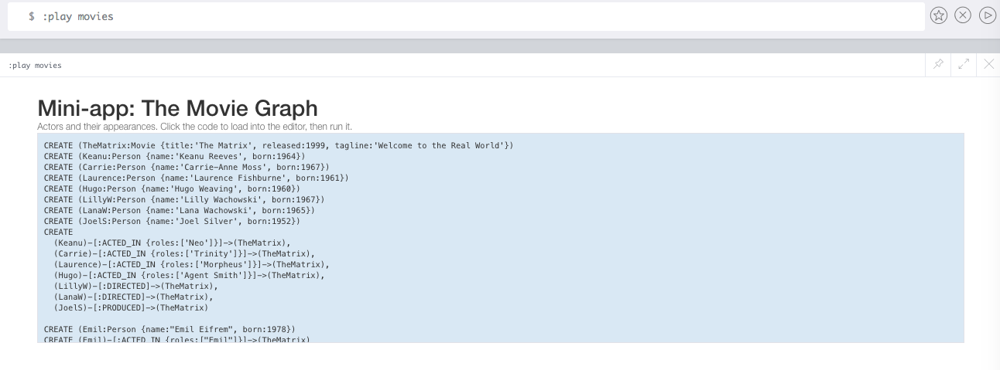
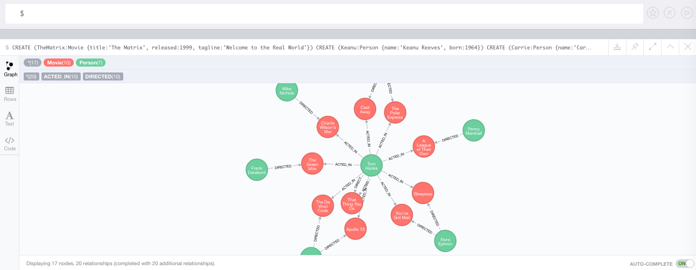
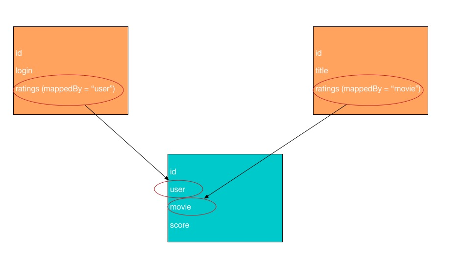
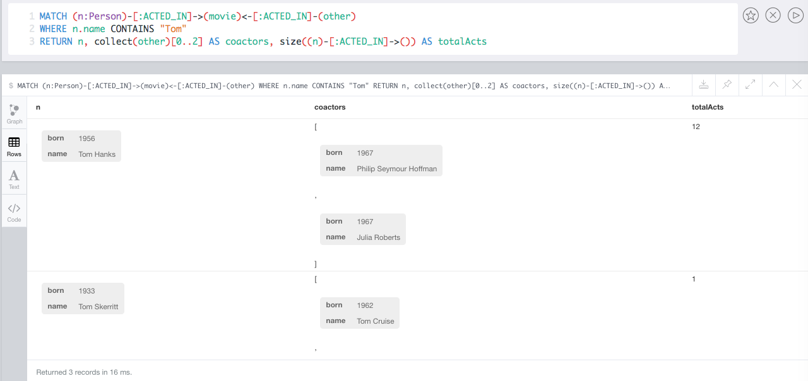

## Getting started with the Neo4j PHP OGM

This quick start guide covers the basics of working with the PHP OGM. At the end you should be able to :

* Install and configure the PHP OGM
* Map PHP objects to Neo4j nodes and relationships
* Use the `EntityManager` to save, load and delete objects in the database

The code for this tutorial is available on this repository : https://github.com/graphaware/neo4j-php-ogm-tutorial

### What is the Neo4j PHP OGM ?

The Neo4j PHP OGM is an **object graph mapper** for PHP5.6+ that provides persistence for PHP objects.
It is heavily inspired by the [Doctrine2](http://www.doctrine-project.org/) project and uses the data mapper pattern 
and dockblock annotations.

### What are entities ?

Entities are PHP objects that can be identified by a unique identifier and represent nodes or relationships in your database.

In contrary to object relational mapper, the Neo4j PHP OGM supports two types of entities : 

* PHP Objects representing **Nodes** in your database
* PHP Objects representing **Relationships** in your datase (named _RelationshipEntity_)

### An example model : The movie database

For this getting started guide, we will implement the Movie Graph model that is available in any Neo4j installation by 
issuing the `:play movies` command in the Neo4j browser.



Having a look at the data model, we can assume the following requirements :

* A _Person_ has a name and a born properties

* A _Person_ can have **ACTED_IN** or **DIRECTED** a _Movie_

* A _Movie_ has a title, a tagline and a release year properties



### Project setup
 
Create a new empty folder for this tutorial project (eg: neo4j-php-ogm-movies) and create a new `composer.json` file :

```json
{
  "require": {
    "graphaware/neo4j-php-ogm": "@rc"
  },
  "autoload": {
    "psr-4": {"Demo\\": "src/"}
  }
}
```

Install the Neo4j PHP OGM by using the Composer command line tool : 

```bash
composer install
```

Create the `src/` directory:

```bash
neo4j-php-ogm-movies
|--src
|--vendor
```

### Creating the EntityManager

The Neo4j PHP OGM public interface is the EntityManager, providing the point of entry to the lifcecyle management
of your entities and maps them from and back the database.

```php
// bootstrap.php
<?php

use GraphAware\Neo4j\OGM\EntityManager;

require_once 'vendor/autoload.php';

$entityManager = EntityManager::create('http://localhost:7474');
```

The argument passed to the factory method of the EntityManager is the connection detail of your Neo4j instance.

### Starting with the Person entity

Let's start with the first entity, the Person. Create a `src/Person.php` class that will contain the `Person` entity definition :

```php
<?php

namespace Demo;

// src/Person.php

class Person
{
    /**
     * @var int
     */
    protected $id;

    /**
     * @var string
     */
    protected $name;

    /**
     * @var int
     */
    protected $born;

    /**
     * @return int
     */
    public function getId()
    {
        return $this->id;
    }

    /**
     * @return string
     */
    public function getName()
    {
        return $this->name;
    }

    /**
     * @param string $name
     */
    public function setName($name)
    {
        $this->name = $name;
    }

    /**
     * @return int
     */
    public function getBorn()
    {
        return $this->born;
    }

    /**
     * @param int $born
     */
    public function setBorn($born)
    {
        $this->born = $born;
    }
}
```


The next step is to apply the metadata that will define how your entities, their properties and references should be mapped to the
database. Metadata for entities is defined using docblock annotations :

```php
<?php

namespace Demo;

use GraphAware\Neo4j\OGM\Annotations as OGM;

// src/Person.php

/**
 *
 * @OGM\Node(label="Person")
 */
class Person
{
    /**
     * @var int
     * 
     * @OGM\GraphId()
     */
    protected $id;

    /**
     * @var string
     * 
     * @OGM\Property(type="string")
     */
    protected $name;

    /**
     * @var int
     * 
     * @OGM\Property(type="int")
     */
    protected $born;
    
    // other code
}
```

The top-level `Node` definition tag defines that the entity represents a node in the database. The `Person#name` and `Person#born`
are defined as `property` attributes. The `id` represents the internal neo4j identifier.

Now let's create a new script that will create a new person into our database :

```php
<?php

use Demo\Person;

require_once 'bootstrap.php';

$newPersonName = $argv[1];
$newPersonBorn = (int) $argv[2];

$person = new Person();
$person->setName($newPersonName);
$person->setBorn($newPersonBorn);

$entityManager->persist($person);
$entityManager->flush();

echo sprintf('Created Person with ID "%d"', $person->getId());
```

```bash
$/demo-ogm-movies> php create-person.php Michael 40
Created Person with ID "2004"
```

If you inspect the database by using the Neo4j browser or the `cypher-shell`, you can see that a Person node has been created :

```bash
$/neo4j-ogm-demo> ./bin/cypher-shell
Connected to Neo4j 3.1.0 at bolt://localhost:7687.
Type :help for a list of available commands or :exit to exit the shell.
Note that Cypher queries must end with a semicolon.
neo4j> MATCH (n:Person) WHERE id(n) = 2004 RETURN n;
n
(:Person {born: 40, name: "Michael"})
neo4j>
```

What is happening under the hood ? Using the `Person` object seems pretty familiar to nowaydays OOP developments. The interesting part 
is the usage of the EntityManager.

To notify the EntityManager that a new entity should be persisted in the database, you have to call the `persist()` method and then call `flush()` 
in order to initiate the transaction against the database.

As in Doctrine, the Neo4j PHP OGM follows the UnitOfWork pattern which detects all entities that were fetched and have changed during the lifetime 
of the request.


The next step is to create a script for fetching all persons :

```php
<?php

// list-persons.php

require_once 'bootstrap.php';

$personsRepository = $entityManager->getRepository(\Demo\Person::class);
$persons = $personsRepository->findAll();

foreach ($persons as $person) {
    echo sprintf("- %s\n", $person->getName());
}
```

```bash
$/demo-ogm-movies> php list-persons.php
- Keanu Reeves
- Carrie-Anne Moss
- Laurence Fishburne
- Hugo Weaving
- Lilly Wachowski
- Lana Wachowski
- Joel Silver
...
```

You can also create a script to find a person by its name :

```php
<?php

// show-person.php

require_once 'bootstrap.php';

$name = $argv[1];

$personsRepository = $entityManager->getRepository(\Demo\Person::class);
$person = $personsRepository->findOneBy(['name' => $name]);

if ($person === null) {
    echo 'Person not found' . PHP_EOL;
    exit(1);
}

echo sprintf("- %s is born in %d\n", $person->getName(), $person->getBorn());
```

```bash
$/demo-ogm-movies> php show-person.php "Al Pacino"
- Al Pacino is born in 1940
```

Updating a person's born year demonstrates the functionality of the UnitOfWork pattern. We only need to find the person 
entity and all its changed properties will be reflected onto the database :

```php
<?php

require_once 'bootstrap.php';

$name = $argv[1];
$newBornYear = (int) $argv[2];

$personsRepository = $entityManager->getRepository(\Demo\Person::class);
/** @var \Demo\Person $person */
$person = $personsRepository->findOneBy(['name' => $name]);

if ($person === null) {
    echo 'Person not found' . PHP_EOL;
    exit(1);
}

$person->setBorn($newBornYear);
$entityManager->flush();
```

Using the cypher-shell we can validate that the changes were persisted : 
```bash
neo4j> MATCH (n:Person {name:"Al Pacino"}) RETURN n;
n
(:Person {born: 1942, name: "Al Pacino"})
```

### Continuing with the Movie entity

So far so good, let's continue by adding the `Movie` entity. The steps are the same as for the example above :

```php
<?php

// src/Movie.php

namespace Demo;

use GraphAware\Neo4j\OGM\Annotations as OGM;

/**
 *
 * @OGM\Node(label="Movie")
 */
class Movie
{
    /**
     * @var int
     *
     * @OGM\GraphId()
     */
    protected $id;

    /**
     * @var string
     *
     * @OGM\Property(type="string")
     */
    protected $title;

    /**
     * @var string
     *
     * @OGM\Property(type="string")
     */
    protected $tagline;

    /**
     * @var int
     *
     * @OGM\Property(type="int")
     */
    protected $released;
    
    // Getters and Setters
}
```

Let's create also the first script that will list some movies with a limit :

```php
<?php

// list-movies.php

require_once 'bootstrap.php';

$limit = isset($argv[1]) ? (int) $argv[1] : 10;

/** @var \Demo\Movie[] $movies */
$movies = $entityManager->getRepository(\Demo\Movie::class)->findBy([], null, $limit);

foreach ($movies as $movie) {
    echo sprintf("- %s\n", $movie->getTitle());
}
```

```bash
$/demo-ogm-movies> php list-movies.php 7
- The Matrix
- The Matrix Reloaded
- The Matrix Revolutions
- The Devil\'s Advocate
- A Few Good Men
- Top Gun
- Jerry Maguire
```

### Adding relationships

Our entities can now be persisted and retrieved from the database but we're missing the possibility to manage relationships
between persons and movies and thus make use of all the potential of our graph.

Let's add the `ACTED_IN` relationship between the person and the movie entities : 

```php
<?php

namespace Demo;

use GraphAware\Neo4j\OGM\Annotations as OGM;
use GraphAware\Neo4j\OGM\Common\Collection;

// src/Person.php

/**
 *
 * @OGM\Node(label="Person")
 */
class Person
{
    /**
     * @var int
     *
     * @OGM\GraphId()
     */
    protected $id;

    // other code

    /**
     * @var Movie[]|Collection
     * 
     * @OGM\Relationship(type="ACTED_IN", direction="OUTGOING", collection=true, mappedBy="actors", targetEntity="Movie")
     */
    protected $movies;
    
    public function __construct()
    {
        $this->movies = new Collection();
    }

    // other code

    /**
     * @return Movie[]|Collection
     */
    public function getMovies()
    {
        return $this->movies;
    }
}
```

First, we add a property that will hold the `Movie`'s entities references and tag it with the `Relationship` annotation.

The annotation has some attributes : 

* **type** : defines the type of the relationship in the database
* **direction**: defines the direction of the relationship from the person node
* **collection**: `true` if the property will reference multiple relationships, false/omitted otherwise
* **mappedBy**: defines the name of the property referencing the person entity on the movie entity
* **targetEntity**: the classname of the referenced entity

Let's do the same for the `Movie` entity : 

```php
<?php

// src/Movie.php

namespace Demo;

use GraphAware\Neo4j\OGM\Annotations as OGM;
use GraphAware\Neo4j\OGM\Common\Collection;

/**
 *
 * @OGM\Node(label="Movie")
 */
class Movie
{
    /**
     * @var int
     *
     * @OGM\GraphId()
     */
    protected $id;

    // other code

    /**
     * @var Person[]|Collection
     *
     * @OGM\Relationship(type="ACTED_IN", direction="INCOMING", collection=true, mappedBy="movies", targetEntity="Person")
     */
    protected $actors;
    
    public function __construct()
    {
        $this->actors = new Collection();
    }

    // other code

    /**
     * @return Person[]|Collection
     */
    public function getActors()
    {
        return $this->actors;
    }
}
```

Now, we can modify our `show-person.php` script to list the movies in which the person acted : 

```php
<?php

// show-person.php

require_once 'bootstrap.php';

$name = $argv[1];

$personsRepository = $entityManager->getRepository(\Demo\Person::class);
/** @var \Demo\Person $person */
$person = $personsRepository->findOneBy(['name' => $name]);

if ($person === null) {
    echo 'Person not found' . PHP_EOL;
    exit(1);
}

echo sprintf("- %s is born in %d\n", $person->getName(), $person->getBorn());
echo "  The movies in which he acted are : \n";
foreach ($person->getMovies() as $movie) {
    echo sprintf("    -- %s\n", $movie->getTitle());
}
```

```bash
$/demo-ogm-movies> php show-person.php "Tom Hanks"
- Tom Hanks is born in 1956
  The movies in which he acted are :
    -- Charlie Wilson's War
    -- The Polar Express
    -- A League of Their Own
    -- Cast Away
    -- Apollo 13
    -- The Green Mile
    -- Cloud Atlas
    -- The Da Vinci Code
    -- That Thing You Do
    -- Joe Versus the Volcano
    -- Sleepless in Seattle
    -- You've Got Mail
```

#### Note on lazy proxies

By default, entities having at least one relationship property will be proxied. A proxy object is an object that extend your 
actual entity but is aware on how and when to fetch the related entities from the database.

A current regression in 1.0.0-RC2 force the user to call the getters of the properties to initialize the related entities, otherwise 
the property value will be null :

```php
$person = $entityManager->getRepository(\Demo\Person::class)->findOneBy(['name'=>'Tom Hanks']);

// if movies property public
$person->movies; // null

$person->getMovies(); // collecion is initialized and loaded from db
```

Let's now go further and create a script that will create an `ACTED_IN` relationship between Emil Eifrem and The Matrix Revolutions movie :
 
```bash
$/demo-ogm-movies> php show-person.php "Emil Eifrem"
- Emil Eifrem is born in 1978
  The movies in which he acted are :
    -- The Matrix
```

```php
<?php

// add-acted-in.php

require_once 'bootstrap.php';

$actor = $argv[1];
$title = $argv[2];

$personsRepo = $entityManager->getRepository(\Demo\Person::class);
$moviesRepo = $entityManager->getRepository(\Demo\Movie::class);

/** @var \Demo\Person $person */
$person = $personsRepo->findOneBy(['name' => $actor]);

if (null === $person) {
    echo sprintf('The person with name "%s" was not found', $actor);
    exit(1);
}

/** @var \Demo\Movie $movie */
$movie = $moviesRepo->findOneBy(['title' => $title]);

if (null === $movie) {
    echo sprintf('The movie with title "%s" was not found', $title);
}

$person->getMovies()->add($movie);
$movie->getActors()->add($person);
$entityManager->flush();

```

```bash
$/demo-ogm-movies> php add-acted-in.php "Emil Eifrem" "The Matrix Revolutions"
```

```bash
$/demo-ogm-movies> php show-person.php "Emil Eifrem"
- Emil Eifrem is born in 1978
  The movies in which he acted are :
    -- The Matrix Revolutions
    -- The Matrix
```

You can also check the result with the cypher-shell :

```bash
neo4j> MATCH (n:Person {name:"Emil Eifrem"})-[:ACTED_IN]->(movie) RETURN movie.title;
movie.title
"The Matrix Revolutions"
"The Matrix"
neo4j>
```

You can have noticed that we referenced the relationship on both the person and the movie. This is up to the 
user to keep a consistent object graph, the OGM will never modify your objects except for loading initial state (for example retrieving the 
object from the graph) or for setting the neo4j internal id when persisting new entities.

You can think that there is no database and that if you don't set the person on the movie entity, you would have then an inconsitent graph
as the movie instance will not be aware of the new person act.

Not keeping a consistent object graph may lead to undesired effects that are not handled and reported to the user in a graceful manner by the OGM.

### Removing entities

In order to remove entities, you can make use of the `EntityManager::remove` method. This method takes the entity's object instance to remove
as argument.

```bash
$/demo-ogm-movies> php create-person.php Jim 45
Created Person with ID "65"⏎
```

```php
<?php

// remove-actor.php

require_once 'bootstrap.php';

$name = $argv[1];

$personsRepo = $entityManager->getRepository(\Demo\Person::class);
$person = $personsRepo->findOneBy(['name' => $name]);

if (null === $person) {
    echo sprintf('The person with name "%s" was not found', $name);
    exit(1);
}

$entityManager->remove($person);
$entityManager->flush();
```

```bash
$/demo-ogm-movies> php remove-actor.php "Jim"
$/demo-ogm-movies> php show-person.php "Jim"
Person not found
```

I have chosen to create a new person first delibaretely. As you might have noticed this person is new and don't have any 
relationships. If you would try to do this with Tom Hanks for example the database would abort the transaction because nodes 
with still relationships cannot be deleted, you would need to delete them in the same transaction.

The OGM offers 2 possible solutions for this use case :

* You can force delete the node by passing `true` as the second argument on the `EntityManager::remove()` method
* You can de-reference all relationships and those will be deleted during the `flush()` lifecycle

If you choose the first possibility, be careful to keep consistency in your object graph.
 
The updated `remove-actor.php` script covers both solutions by chosing the deletion mode on the command line :

```php
<?php

// remove-actor.php

require_once 'bootstrap.php';

$name = $argv[1];
$mode = isset($argv[2]) && 'force' === $argv[2] ? 'force' : 'soft';

echo sprintf("Deletion mode is %s\n", strtoupper($mode));

$personsRepo = $entityManager->getRepository(\Demo\Person::class);
/** @var \Demo\Person $person */
$person = $personsRepo->findOneBy(['name' => $name]);

if (null === $person) {
    echo sprintf('The person with name "%s" was not found', $name);
    exit(1);
}

if ('force' === $mode) {
    $entityManager->remove($person, true);
} elseif ('soft' == $mode) {
    foreach ($person->getMovies() as $movie) {
        $movie->getActors()->removeElement($person);
    }
    $person->getMovies()->clear();
    $entityManager->remove($person);
}

$entityManager->flush();
```

```bash
$/demo-ogm-movies> php show-person.php "Al Pacino"
- Al Pacino is born in 1940
  The movies in which he acted are :
    -- The Devil's Advocate
$/demo-ogm-movies> php remove-actor.php "Al Pacino"
Deletion mode is SOFT
$/demo-ogm-movies> php show-person.php "Al Pacino"
Person not found
```

```bash
$/demo-ogm-movies> php show-person.php "Tom Cruise"
- Tom Cruise is born in 1962
  The movies in which he acted are :
    -- Jerry Maguire
    -- Top Gun
    -- A Few Good Men
$/demo-ogm-movies> php remove-actor.php "Tom cruise"
Deletion mode is FORCE
$/demo-ogm-movies> php show-person.php "Tom Cruise"
Person not found
```

Using the force method will result in the following Cypher query : 

```
MATCH (n) WHERE id(n) = {id} DETACH DELETE n
```


### Removing relationships

Removing relationship references is done by removing the object reference on both entities. Keeping a consistent object graph play a 
fundamental role here to not have relationships re-created automatically.

```bash
$/demo-ogm-movies> php show-person.php "Emil Eifrem"
- Emil Eifrem is born in 1978
  The movies in which he acted are :
    -- The Matrix Revolutions
    -- The Matrix
```

```php
<?php

// remove-actor-movie.php

require_once 'bootstrap.php';

$name = $argv[1];
$title = $argv[2];

$actorRepo = $entityManager->getRepository(\Demo\Person::class);

/** @var \Demo\Person $actor */
$actor = $actorRepo->findOneBy(['name' => $name]);

if (null === $actor) {
    echo sprintf('Person with name "%s" not found', $name);
    exit(1);
}

$movie = null;

foreach ($actor->getMovies() as $m) {
    if ($m->getTitle() === $title) {
        $movie = $m;
    }
}

if (null === $movie) {
    echo sprintf('No movie with title "%s" was found on the Person instance', $title);
    exit(1);
}

$actor->getMovies()->removeElement($movie);
$movie->getActors()->removeElement($actor);
$entityManager->flush();
```

```bash
$/demo-ogm-movies> php remove-actor-movie.php "Emil Eifrem" "The Matrix"
```

```bash
$/demo-ogm-movies> php show-person.php "Emil Eifrem"
- Emil Eifrem is born in 1978
  The movies in which he acted are :
    -- The Matrix Revolutions
```

### Relationship Entities

In Neo4j, relationships are first class citizens. Meaning that they are as important as nodes themselves. The OGM has the same 
philosophy in mind and supports another type of entity, called `Relationship Entity`.

Let's see it by example and extend our domain model with the following requirements : 

* A new `User` entity will represent user nodes
* User will have a `RATED` outgoing relationship towards movies
* `RATED` relationships have a `score` property being a float type

Let's create the User entity : 

```php
<?php

namespace Demo;

use GraphAware\Neo4j\OGM\Common\Collection;
use GraphAware\Neo4j\OGM\Annotations as OGM;

/**
 *
 * @OGM\Node(label="User")
 */
class User
{
    /**
     * @var int
     *
     * @OGM\GraphId()
     */
    protected $id;

    /**
     * @var string
     *
     * @OGM\Property(type="string")
     */
    protected $login;

    /**
     * @var Collection
     *
     * @OGM\Relationship(relationshipEntity="MovieRating", type="RATED", direction="OUTGOING", collection=true, mappedBy="user")
     */
    protected $ratings;

    public function __construct()
    {
        $this->ratings = new Collection();
    }
    
    // getters and setters
}
```

A few notes : 

* The `targetEntity` on the relationship annotation is replaced by `relationshipEntity`
* The `mappedBy` attribute on the relationship annotation is refering the the property name that will be used on the relationship entity 
and not on the movie entity

Create now the `Relationship Entity` itself :

```php
<?php

namespace Demo;

use GraphAware\Neo4j\OGM\Annotations as OGM;

/**
 *
 * @OGM\RelationshipEntity(type="RATED")
 */
class MovieRating
{
    /**
     * @var int
     *
     * @OGM\GraphId()
     */
    protected $id;

    /**
     * @var User
     *
     * @OGM\StartNode(targetEntity="User")
     */
    protected $user;

    /**
     * @var Movie
     *
     * @OGM\EndNode(targetEntity="Movie")
     */
    protected $movie;

    /**
     * @var float
     *
     * @OGM\Property(type="float")
     */
    protected $score;

    public function __construct(User $user, Movie $movie, $score)
    {
        $this->user = $user;
        $this->movie = $movie;
        $this->score = $score;
    }
    
    // getters
}
```

Some explanations about the new annotations : 

* **RelationshipEntity** top-level annotation defines the entity as relationship object
* **StartNode** / **EndNode** references the start and end entities for this relationship
* The relationship object also has a **GraphId** annotation

The last step is to add the ratings on the movie entity as well :

```php
<?php

// src/Movie.php

namespace Demo;

use GraphAware\Neo4j\OGM\Annotations as OGM;
use GraphAware\Neo4j\OGM\Common\Collection;

/**
 *
 * @OGM\Node(label="Movie")
 */
class Movie
{
    /**
     * @var int
     *
     * @OGM\GraphId()
     */
    protected $id;

    // other code

    /**
     * @var MovieRating[]
     * 
     * @OGM\Relationship(relationshipEntity="MovieRating", type="RATED", direction="INCOMING", collection=true, mappedBy="movie")
     */
    protected $ratings;

    public function __construct()
    {
        $this->actors = new Collection();
        $this->ratings = new Collection();
    }

    /**
     * @return int
     */
    public function getId()
    {
        return $this->id;
    }

    // other code

    /**
     * @return MovieRating[]
     */
    public function getRatings()
    {
        return $this->ratings;
    }
}
```

Now let's add a useful method on the User entity that will represent adding a new rating for a movie from this user :

```php
<?php

namespace Demo;

use GraphAware\Neo4j\OGM\Common\Collection;
use GraphAware\Neo4j\OGM\Annotations as OGM;

/**
 *
 * @OGM\Node(label="User")
 */
class User
{
    // other code

    public function rateMovieWithScore(Movie $movie, $score)
    {
        $rating = new MovieRating($this, $movie, (float) $score);
        $this->getRatings()->add($rating);
        $movie->getRatings()->add($rating);
    }
}
```

##### Note on the mappedBy property when using Relationship Entities

You might notice that the mappedBy property do not reference the property on the Movie or User class, but rather the property 
used on the Relationship Entity itself.



As of RC4, this is now mandatory to ensure a correct hydration of start and end nodes.


It is good practice to have methods in your application business logic that ensure bi-directional reference as we do here in the method.

Now, we will create some scripts that will perform the following action : 

* create a user
* show user and his ratings
* add a rating from a user to a movie

```php
<?php

// create-user.php

require_once 'bootstrap.php';

$login = $argv[1];

$user = new \Demo\User();
$user->setLogin($login);

$entityManager->persist($user);
$entityManager->flush();

echo sprintf('Created user with login "%s"', $login);
```

```bash
$/demo-ogm-movies> php create-user.php julius
Created user with login "julius"⏎
```

```php
<?php

// show-user.php

require_once 'bootstrap.php';

$login = $argv[1];

$userRepo = $entityManager->getRepository(\Demo\User::class);

/** @var \Demo\User $user */
$user = $userRepo->findOneBy(['login' => $login]);

echo sprintf("User '%s' has the following ratings : \n", $user->getLogin());
foreach ($user->getRatings() as $rating) {
    echo sprintf(" - %s : %f\n", $rating->getMovie()->getTitle(), $rating->getScore());
}
```

```bash
$/demo-ogm-movies> php show-user.php julius
User 'julius' has the following ratings :
```

```php
<?php

// rate-movie.php

require_once 'bootstrap.php';

$login = $argv[1];
$title = $argv[2];
$score = (float) $argv[3];

/** @var \Demo\User $user */
$user = $entityManager->getRepository(\Demo\User::class)->findOneBy(['login' => $login]);

/** @var \Demo\Movie $movie */
$movie = $entityManager->getRepository(\Demo\Movie::class)->findOneBy(['title' => $title]);

$user->rateMovieWithScore($movie, $score);
$entityManager->flush();
```

```bash
$/demo-ogm-movies> php show-user.php julius
User 'julius' has the following ratings :
$/demo-ogm-movies> php rate-movie.php julius "The Matrix" 4.5
$/demo-ogm-movies> php show-user.php julius
User 'julius' has the following ratings :
 - The Matrix : 4.500000
```

Don't forget that relationship entities are `Entity` objects and are treated like nodes, so for removing a rating, we would 
perform the same operation as for nodes on the `EntityManager::remove()` method.

```php
<?php

// remove-rating.php

require_once 'bootstrap.php';

$login = $argv[1];
$title = $argv[2];

/** @var \Demo\User $user */
$user = $entityManager->getRepository(\Demo\User::class)->findOneBy(['login' => $login]);

/** @var \Demo\Movie $movie */
$movie = $entityManager->getRepository(\Demo\Movie::class)->findOneBy(['title' => $title]);

$ratingToDelete = null;
foreach ($user->getRatings() as $rating) {
    if ($rating->getMovie() === $movie) {
        $ratingToDelete = $rating;
    }
}

if (null === $ratingToDelete) {
    echo sprintf('Could not found rating from %s on %s', $user->getLogin(), $movie->getTitle());
    exit(1);
}

$user->getRatings()->removeElement($ratingToDelete);
$movie->getRatings()->removeElement($ratingToDelete);
$entityManager->remove($ratingToDelete);
$entityManager->flush();
```

```bash
$/demo-ogm-movies> php show-user.php julius
User 'julius' has the following ratings :
 - The Matrix : 4.500000
$/demo-ogm-movies> php remove-rating.php julius "The Matrix"
$/demo-ogm-movies> php show-user.php julius
User 'julius' has the following ratings :
```

### Caveats related to Proxy and Lazy loading

As of 1.0.0-RC2, some caveats are to be taken into account for relationships proxies.

>>> Lazy loading for simple relationships (meaning non-collection) is triggered when the getter is called, meaning that before doing any operation on a relationship property, you would 
 have to call its getter to be sure it is initialized.
 
An example is the following : 

```
User -> OWNS -> CAR
CAR <- OWNS <- USER
```

If you would load the User and the car separately with the EntityManager : 

```php
/** @var Car $bugatti */
$bugatti = $this->em->getRepository(Car::class)->findOneBy(array('model' => 'Bugatti'));
/** @var Person $mike */
$mike = $this->em->getRepository(Person::class)->findOneBy(array('name' => 'Mike'));
```

Nor mike's car property or car's owner property would be lazy loaded. Meaning that :

```php
$mike->setCar(null);
$bugatti->setOwner(null);
$this->em->flush();
```

Would not result in deleting the relationship between the person and the car, however if you call the getter on one of both entities : 

```php
$mike->getCar();
```

Then it would be fine.

NB: This is known caveat and it will be tackled in the next RC's. collections will use Doctrine's persistent collections and 
single relationships will be automatically loaded with the entity itself.


Collections of relationships are however better handled (since RC3) with a LazyCollection backed by a concrete collection. The behavior is 
the following :

* When an entity is loaded from the repository, its property being a relationship collection will be initialized with a `LazyCollection` object
* Calls on the `count()` and `add()` methods will not trigger the loading of the entire relationships set, meaning you can add relationships without loading all of them
* As of RC3, `contains()` still load the collection fully, this will be improved in the next RC's along with the addition of the `slice()` method for pagination

### Using custom Cypher queries

While using direct methods on repositories is very handy, often you will need to create your own Cypher queries for advanced 
use cases.

Let's see how this all works by explaining it step by step :

```php
<?php

// native-query.php

require_once 'bootstrap.php';

$em = $entityManager;

$query = $em->createQuery('MATCH (n:Person) WHERE n.name CONTAINS {part} RETURN n LIMIT 10');
$query->addEntityMapping('n', \Demo\Person::class);
$query->setParameter('part', 'Tom');

$result = $query->execute();

foreach ($result as $person) {
    echo sprintf('Person found with name "%s"' . PHP_EOL, $person->getName());
}
```

```bash
$> php native-query.php
Person found with name "Tom Cruise"
Person found with name "Tom Skerritt"
Person found with name "Tom Hanks"
Person found with name "Tom Tykwer"
```

You invoke the native query handler by calling `EntityManager::createQuery()` and pass it the Cypher query string.

Next, you define that the `n` result alias of the query should be mapped to `Person` objects and you pass a `part` parameter.

You then execute the query and receive results back.

The result is depending on your query and result aliases and has the following behavior : 

* If only one alias is returned and is mapped to an object class, it returns a collection of objects : 
 
  ```php
  Array
      [0] => Object
      [1] => Object
          ...
  ```

* If more than one alias is returned, it will returned a mixed result set, let's see the next example :

```php
<?php

// native-query-2.php

require_once 'bootstrap.php';

$em = $entityManager;

$query = $em->createQuery('MATCH (n:Person)-[:ACTED_IN]->(movie)<-[:ACTED_IN]-(other)
WHERE n.name CONTAINS "Tom"
RETURN n, collect(other)[0..2] AS coactors, size((n)-[:ACTED_IN]->()) AS totalActs');
$query
    ->addEntityMapping('n', \Demo\Person::class)
    ->addEntityMapping('coactors', \Demo\Person::class, \GraphAware\Neo4j\OGM\Query::HYDRATE_COLLECTION);

$result = $query->execute();

foreach ($result as $row) {
    echo sprintf('Person found with name "%s", he played in %d movies' . PHP_EOL, $row['n']->getName(), $row['totalActs']);
    echo 'His first two co-actors are ' . PHP_EOL;
    foreach ($row['coactors'] as $coactor) {
        echo sprintf(' -- %s' .PHP_EOL, $coactor->getName());
    }
}
```

```bash
$> php native-query-2.php
Person found with name "Tom Hanks", he played in 12 movies
His first two co-actors are
 -- Philip Seymour Hoffman
 -- Julia Roberts
Person found with name "Tom Skerritt", he played in 1 movies
His first two co-actors are
 -- Tom Cruise
 -- Val Kilmer
Person found with name "Tom Cruise", he played in 3 movies
His first two co-actors are
 -- Cuba Gooding Jr.
 -- Noah Wyle
```

To make it clearer, this is the result output of the query in the Neo4j browser : 



The `execute()` method will return what is called a mixed result represented by rows.

Each row will be represented as the following : 

```bash
[0] => Array
        'n' => Object Person
        'coactors' => Array[Object Person]
        'totalActs' => scalar (integer)
[1] => Array
        'n' => Object Person
        'coactors' => Array[Object Person]
        'totalActs' => scalar (integer)
      ...
```

To summarize, you can define the mapping of the result aliases with the following hints : 

* `Query::HYDRATE_COLLECTION` => collection of object entities
* `Query::HYDRATE_SINGLE` => single entity

Aliases not being mapped via the `addEntityMapping` are returned as raw results